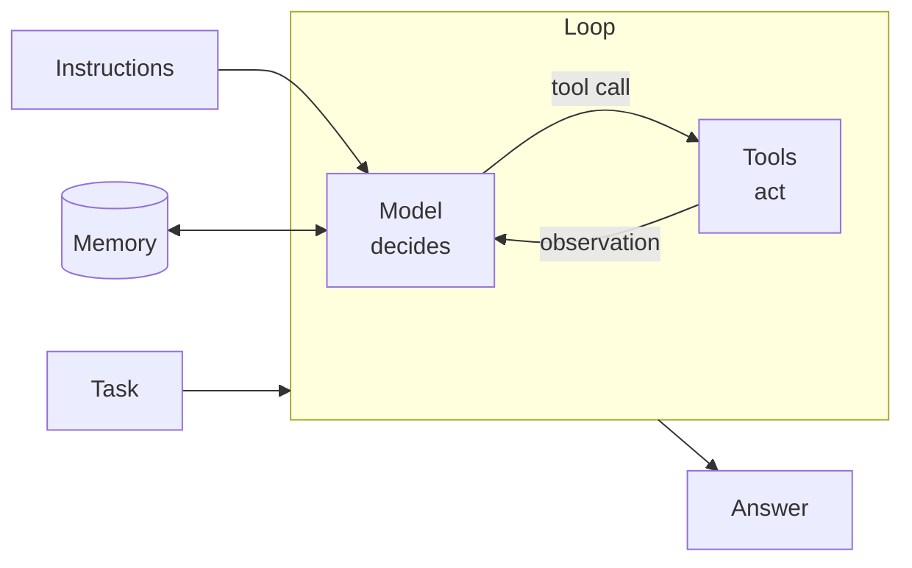

# Anatomy of an agent

:::note[Reference page]
Written and reviewed. Covered in [Module 01](/modules/01-foundations/).
:::

Strip away the frameworks and every agentic system has the same five parts.
Knowing them is what lets you read an unfamiliar agent framework in an
afternoon: you are looking for where it put each one, and what it decided on
your behalf.



## 1. The model

The decision-maker. Given the conversation so far, it chooses: answer now, or
call a tool.

What matters for agents is not general knowledge but **tool-selection accuracy
and instruction adherence** — whether it picks the right tool with the right
arguments, and whether it respects your stop conditions. Those two properties
differ more between model tiers than benchmark scores suggest, and they are
what you should measure when considering a cheaper model. See
[choosing a model](/building-blocks/models).

## 2. The instructions

The system prompt. For an agent it is a **policy**, not a question, and it
needs to answer four things:

- **Who you are** — the role and its scope
- **What you may do** — which tools, under what conditions
- **When to stop** — the single most commonly omitted piece
- **What to do when stuck** — say so, or guess? Escalate, or retry?

Omit the third and you get runaway loops. Omit the fourth and you get confident
fabrication, because a model with no instruction for failure will produce an
answer rather than admit it cannot. See
[prompting for agents](/building-blocks/prompting-for-agents).

## 3. The tools

How the agent affects anything outside its own context. Each tool is two
things at once: a function the runtime executes, and a **schema plus
description the model reads to decide when to use it**.

That description is prompt, not documentation. It is the only signal telling
the model that `search_web` is for current events and `fetch_page` is for
confirming a detail. Write it as the condition under which the tool is the
right choice.

In this repo, the schema is derived from your type hints and docstring so the
two halves cannot drift apart:

```python
@tool
def search_web(query: str, max_results: int = 5) -> str:
    """Search the public web for current information.

    Use this when the answer depends on recent events or specific numbers.

    Args:
        query: A focused search query. Narrow queries beat broad ones.
        max_results: Number of results, 1 to 10.
    """
```

See [tools and function calling](/building-blocks/tools-and-function-calling).

## 4. The memory

Four different things get called memory, and conflating them causes real bugs:

| Kind | Lives for | Example |
|---|---|---|
| **Message history** | One run | The conversation, including tool results |
| **Scratchpad** | One run | Notes the agent keeps deliberately |
| **Retrieved context** | One step | Documents pulled in for this question |
| **Durable facts** | Across runs | "This user prefers metric units" |

Module 01's agent uses only the first. The others arrive in
[Module 06](/modules/06-memory-context/). The reason to name them now is that
"add memory" is not a task — you have to say which one.
See [memory and state](/building-blocks/memory-and-state).

## 5. The loop

The part that makes it an agent rather than a function call:

```
while not done and steps < limit:
    response = model(history, tools)
    if response has tool calls:
        for call in response.tool_calls:
            history.append(run(call))
    else:
        done = True
```

That is the whole idea. This repo's implementation is in
[`src/agentic_ai/patterns/tool_use.py`](https://github.com/CodexploreRepo/agentic-ai/blob/main/src/agentic_ai/patterns/tool_use.py)
and is worth reading once in full — about eighty lines of control flow sits
underneath every agent framework you will ever evaluate.

## The three details that bite

The loop above is correct and incomplete. Three things separate it from
something you would run on real traffic, and all three are choices rather than
defaults:

**A step limit.** Without one, a tool the model cannot satisfy produces an
infinite loop that bills you the whole way. A step limit is not a safety net
to be raised when hit — a run that needs more than ten steps is usually
missing a tool, not short of steps.

**Tool errors go back to the model as text.** A model told *why* its call
failed will usually fix it next turn. A model handed an exception sees nothing
at all, because the exception killed the run. So `Toolbox.dispatch` returns
error strings instead of raising:

```python
result = toolbox.dispatch(call)   # "Error: tool 'search_web' failed: timeout"
history.append(Message.tool_result(call.id, result))
```

**The loop records what it did.** The final answer does not reveal that the
agent searched four times and gave up. The [trace](/production/observability-and-tracing)
does, and it is the only artefact that makes a failure reproducible.

## Reading a framework through this lens

Pick up any agent framework and ask where it put these five, and what it chose
for you:

- Is the loop visible, or buried in a `.run()` you cannot step through?
- Can you see the exact messages sent to the model?
- What is the default step limit, and is there one?
- How are tool errors surfaced — to you, or to the model?
- What does it record by default?

The answers tell you more about whether a framework will survive your
production incident than any feature list. See
[frameworks](/frameworks/).

## Sources

- DeepLearning.AI, [*Agentic AI*](https://www.deeplearning.ai/courses/agentic-ai) — agentic design patterns overview
- Anthropic, *Building Effective Agents* — the augmented-LLM building block
- Yao et al., [*ReAct*](https://arxiv.org/abs/2210.03629) — reasoning and acting interleaved
- Koenigstein, *AI Agents: The Definitive Guide*, ch. 1 and ch. 5

---

*See [attribution and originality policy](/references/attribution).*
